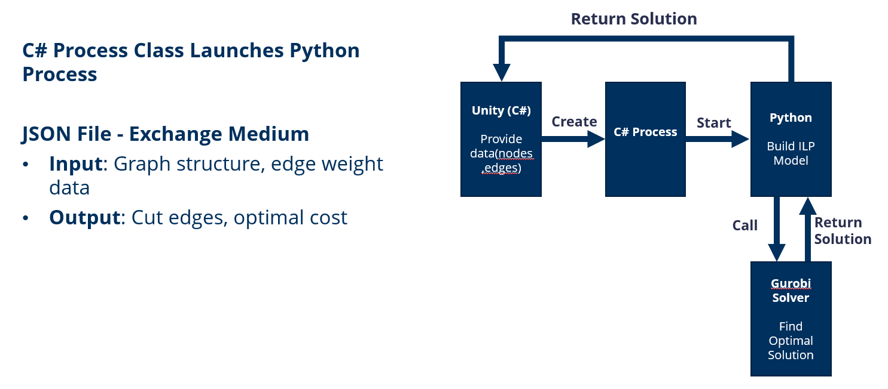

# Multicut Game — Alliance Divider

> **Cut the Enemies, Unite the Allies**
>
> A strategy puzzle game that transforms the NP-hard Multicut problem from combinatorial optimization into an interactive alliance-building experience.

## Table of Contents

- [Mathematical Background](#mathematical-background)
- [Game Setting](#game-setting)
- [How to Play](#how-to-play)
- [Gameplay Features](#gameplay-features)
- [Difficulty and Level System](#difficulty-and-level-system)
- [Technical Implementation](#technical-implementation)
- [Future Work](#future-work)
- [References](#references)

## Mathematical Background

### The Multicut Problem

The Multicut problem is a **combinatorial optimization** problem. The goal is to cut an undirected graph into multiple connected components while minimizing the total cost of cut edges.

#### Formal Definition

Let $G = (V, E)$ be an undirected graph. A subset of edges $M \subseteq E$ is called a **multicut** of $G$ if and only if, for every cycle $C = (V_C, E_C)$ in the graph, the following holds:

$$\lvert M \cap E_C \rvert \neq 1$$

In other words, no cycle is allowed to contain exactly one cut edge. The set of all multicuts of $G$ is denoted by $\mathcal{M}(G)$.

#### Optimization Objective

Given edge costs $c_e \in \mathbb{R}$ for each edge $e \in E$, the Multicut optimization problem is:

$$
\min_{M \in \mathcal{M}(G)} \sum_{e \in M} c_e
$$

> **Intuition**: edge costs can be positive or negative. Positive-cost edges represent friendly relations (expensive to cut), while negative-cost edges represent hostile relations (beneficial to cut). The player seeks the minimum total cutting cost.

#### Cycle Inequalities

The key Multicut validity rule is the **cycle inequality**: no cycle may have exactly one cut edge. This implies:

- If one edge on a cycle is cut, at least one more edge on that cycle must also be cut.
- This guarantees consistency of components: nodes split into different groups cannot remain connected by an uncut path.

#### Computational Complexity

The Multicut problem is **NP-hard** [3, 6], so an efficient exact algorithm is unlikely in general. Nevertheless, it has strong real-world impact [2, 12], motivating extensive theoretical [3, 5, 7, 11] and algorithmic [1, 4, 6, 9, 10] research.

#### Brief History

- **Grötschel & Wakabayashi (1989)** [6]: early study on complete graphs.
- **Chopra & Rao (1993)** [3]: extension to general graphs.

The same family of problems appears under related names:

- **Correlation Clustering** [1]
- **Coalition Structure Generation** [13]

## Game Setting

- **World**: city-states with complex friendly/hostile relations.
- **Player role**: a royal strategist discovering hidden alliance structures.
- **Goal**: cut hostile ties, preserve friendly ties, and form stable alliances.

## How to Play

### Steps

1. Hold the **right mouse button** to enter "Cut Mode".
2. Choose **valid and low-cost** edges to cut.
3. Observe the result and optimize iteratively.

### What Is a Valid Cut?

A cut is valid if it separates at least one target pair of vertices into different territories.

### Why Low-Cost Edges?

Cutting low-cost edges reduces total cost and makes it easier to reach the optimal target value.

### Unit Types

- **Urban**: spawns on land tiles.
- **Port**: spawns only on water tiles.

### Connection Strength

Edge labels indicate relationship strength:

- Larger values -> tighter relation, higher cut cost.
- Smaller values -> looser relation, lower cut cost.

## Gameplay Features

### HUD

- **Level display**: format `Difficulty_LevelID` (e.g., `Easy_01`).
- **Cut limit**: remaining / total cuts.
- **Cost display**: current cost / optimal target cost.

### Territory View

With "Show Territory" enabled:

- Alliance boundaries become visually clear.
- Abstract graph structure is materialized as map territory.
- Different alliances are color-coded.
- Units in the same color area connected by uncut edges belong to one alliance.

### Hint System

When "Hint" is enabled, the game shows the optimal cut set computed by the ILP solver.

### Revert System

Two revert options:

- Reconnect a previously cut edge directly.
- Use the `Revert` button to undo the latest action.

## Difficulty and Level System

The game uses an **infinite level generation** pipeline with three difficulties:

| Difficulty | Node Count | Extra Mechanics |
|-----------|------------|-----------------|
| **Easy** | Fewer nodes | Core gameplay only |
| **Medium** | More nodes | Timer added |
| **Hard** | Many nodes | Timer + penalty edges (cutting reduces remaining time) |

### Weight Balancing Mechanism

To keep levels strategic and non-trivial, the game applies a smart balancing algorithm:

- Keep approximately **35% negative-weight** edges.
- Ensure at least **3 negative-weight** edges.
- Flip the smallest positive weights first when balancing is needed.
- Apply minimal changes only (conservative adjustment).

## Technical Implementation

### Scene Construction

#### 1) Poisson Disk Sampling

Generates city-state positions with minimum-distance constraints, producing random yet evenly distributed nodes.

#### 2) Delaunay Triangulation

Builds graph connectivity while avoiding skinny triangles and edge intersections.

#### 3) Auto Centering and Scaling

Normalizes map bounds to screen space for different map sizes and resolutions.

### TileMap Generation

Uses [TiledProceduralHexTerrainGenerator](https://github.com/HextoryWorld/TiledProceduralHexTerrainGenerator):

1. Generate random height map.
2. Overlay multi-layer details.
3. Classify terrain types.
4. Add humidity variation.

Integration handles coordinate mapping from Tilemap `(q, r)` to Unity world `(x, y)`, offset correction, and Y-axis inversion.

### ILP Solver (Gurobi)

The Multicut problem is NP-hard, so exact optimization is expensive. We use **Gurobi ILP** for globally optimal solutions:

| Method | Limitation | Gurobi ILP Advantage |
|-------|------------|----------------------|
| Heuristics | Fast but no global optimality guarantee | Industrial speed + provable global optimum |
| Approximation | Guarantee on bounds but weaker practical solutions | Exact optimization, not approximation |
| Brute force | Infeasible | Practically solvable with industrial optimization |

### System Integration: Unity -> Python

A C# `Process` launches Python, and JSON files are used for data exchange:

- **Input**: graph structure and edge weights.
- **Output**: cut edges and optimal objective value.

### Alliance Territory Coloring

A nearest-neighbor based assignment maps terrain tiles to city-states to visualize alliances clearly.

## Demo Video

-see  `releases/demo.mp4`

## Future Work

- Improve territory rendering performance and reduce lag.
- Add random events that dynamically modify edge weights.
- Let hostile city-states actively repair cut edges.
- Make terrain features (mountains, rivers, forests) affect edge weights.

## References

1. Bansal, N., Blum, A., & Chawla, S. (2004). Correlation clustering. *Machine Learning*, 56(1–3), 89–113.
2. Beier, T., Pape, C., et al. (2017). Multicut brings automated neurite segmentation closer to human performance. *Nature Methods*, 14(2), 101–102.
3. Chopra, S., & Rao, M. R. (1993). The partition problem. *Mathematical Programming*, 59(1–3), 87–115.
4. Demaine, E. D., Emanuel, D., Fiat, A., & Immorlica, N. (2006). Correlation clustering in general weighted graphs. *Theoretical Computer Science*, 361(2–3), 172–187.
5. Deza, M. M., Grötschel, M., & Laurent, M. (1992). Clique-web facets for multicut polytopes. *Mathematics of Operations Research*, 17(4), 981–1000.
6. Grötschel, M., & Wakabayashi, Y. (1989). A cutting plane algorithm for a clustering problem. *Mathematical Programming*, 45(1), 59–96.
7. Grötschel, M., & Wakabayashi, Y. (1990). Facets of the clique partitioning polytope. *Mathematical Programming*, 47, 367–387.
8. Horňáková, A., Lange, J.-H., & Andres, B. (2017). Analysis and optimization of graph decompositions by lifted multicuts. In *ICML*.
9. Klein, P. N., Mathieu, C., & Zhou, H. (2015). Correlation clustering and two-edge-connected augmentation for planar graphs. In *STACS*.
10. Levinkov, E., Kirillov, A., & Andres, B. (2017). A comparative study of local search algorithms for correlation clustering. In *GCPR*.
11. Oosten, M., Rutten, J. H. G. C., & Spieksma, F. C. R. (2001). The clique partitioning problem: facets and patching facets. *Networks*, 38(4), 209–226.
12. Tang, S., Andriluka, M., Andres, B., & Schiele, B. (2017). Multiple people tracking by lifted multicut and person re-identification. In *CVPR*.
13. Voice, T., Polukarov, M., & Jennings, N. R. (2012). Coalition structure generation over graphs. *Journal of Artificial Intelligence Research*, 45, 165–196.
